# Base64
A 68k carrier board in DIP-64 that takes the [iCESugar-Pro-v1.3](https://github.com/wuxx/icesugar-pro) FPGA module

***

<a href="images/Screenshot_Base64_pic1.png">
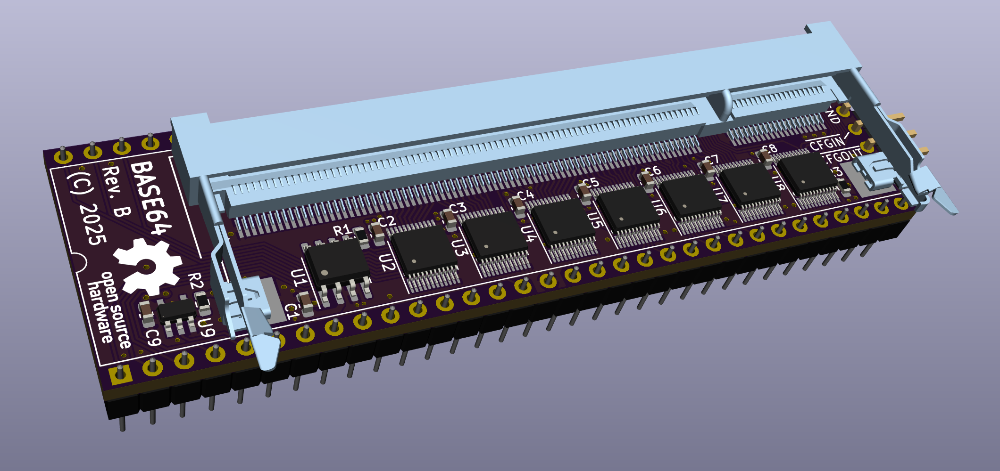
</a>
 
<a href="images/Screenshot_Base64_pic2.png">
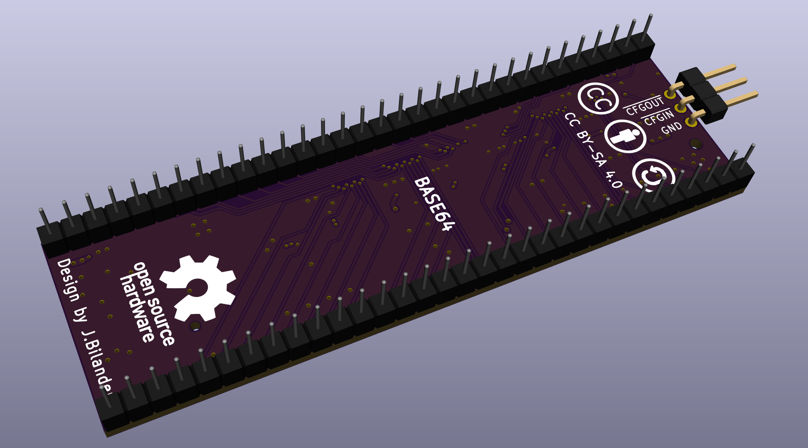
</a>

***

**Contents**

- [Hardware overview (Rev C)](#hardware-overview-rev-c)
- [Clock architecture](#clock-architecture)
- [Required module](#required-module)
- [Bill of materials](#bill-of-materials)
- [Build guide](#build-guide)
- [Status](#status)

***

## Hardware overview (Rev C)

- 4-layer PCB with continuous ground plane on layer 2 and +5V plane on layer 3
- iCESugar-Pro v1.3 FPGA module mounts via 200-pin SO-DIMM (DDR2) socket
- DIP-64 footprint, pin-compatible with the MC68000 socket in an Amiga 500 (or similar 68k host)
- 7× SN74CBTD3861 FET bus switches for bidirectional 5 V ↔ 3.3 V level translation on all bus signals
- Clock subsystem: 7 MHz host clock → 84 MHz phase-aligned output to the FPGA, locked to the host's 7 MHz with ~300 ps skew
- Autoconfig daisy-chain header (J2) for future Amiga-specific firmware use
- 3.3 V rail generated locally from the 5 V CPU socket supply via TLV75533 LDO

## Clock architecture

The host system provides a 7.09 MHz reference (E-clock derivative) on the CPU socket pin 15.
This is buffered by the 74LVC1G17 Schmitt-trigger gate (powered from the local 3.3 V rail,
with 5 V-tolerant inputs) and routed both to the FPGA at PT27A (C7, PCLKT0_1/+) and to the
ICS570B zero-delay clock multiplier (configured for 12× via floating S0/S1 with CLK/2
feedback).

The 570B produces a phase-aligned 84 MHz on CLK and 42 MHz on CLK/2. The 84 MHz output
feeds the FPGA at PL26A (L1, PCLKT6_1/HS+), which is well above the ECP5's 8 MHz PFD
minimum and locks reliably to the on-chip PLL. Inside the FPGA, the 84 MHz is divided
down to produce turbo CPU clocks (14 / 21 / 28 / 42 MHz) that remain phase-aligned to
the original 7 MHz reference.

## Required module

The Base64 carrier board requires an [iCESugar-Pro v1.3 FPGA module](https://github.com/wuxx/icesugar-pro) by Muse Lab, which mounts into the SO-DIMM socket (J1). The module carries the Lattice ECP5 LFE5U-25F-6BG256C FPGA along with onboard 32 MB SDRAM, 32 MB SPI flash, and an iCELink USB-C programmer.

Available from the official [Muse Lab AliExpress store](https://www.aliexpress.com/item/1005002270742248.html).

## Bill of materials

| Ref | Qty | Value / Part | Description | Package | Mouser P/N |
|-----|-----|--------------|-------------|---------|------------|
| U1 | 1 | ICS570BILF | Zero-delay clock multiplier with feedback (12× config) | SOIC-8 | [972-570BLFT](https://www.mouser.com/ProductDetail/972-570BLFT) |
| U2–U8 | 7 | SN74CBTD3861DGVR | 10-bit FET bus switch with 5 V→3.3 V diode level shift | TVSOP-24 | [595-SN74CBTD3861DGVR](https://www.mouser.com/ProductDetail/595-SN74CBTD3861DGVR) |
| U9 | 1 | SN74LVC1G17DBVR | Single Schmitt-trigger buffer, 5 V-tolerant inputs | SOT-23-5 | [595-SN74LVC1G17DBVR](https://www.mouser.com/ProductDetail/595-SN74LVC1G17DBVR) |
| U10 | 1 | TLV75533PDBVR | 3.3 V LDO regulator, 500 mA, fixed output | SOT-23-5 | [595-TLV75533PDBVR](https://www.mouser.com/ProductDetail/595-TLV75533PDBVR) |
| C1 | 1 | 1 µF | LDO input cap, X7R, 25 V | 0805 | [187-CL21B105KAFNNNE](https://www.mouser.com/ProductDetail/187-CL21B105KAFNNNE) |
| C2–C10 | 9 | 100 nF | CBTD / buffer / LDO output decoupling, X7R, 50 V | 0603 | [187-CL10B104KA8NNNC](https://www.mouser.com/ProductDetail/187-CL10B104KA8NNNC) |
| C11 | 1 | 10 nF | 570B VDD decoupling (per datasheet), X7R, 50 V | 0603 | [187-CL10B103KA8WPNC](https://www.mouser.com/ProductDetail/187-CL10B103KA8WPNC) |
| R1–R2 | 2 | 33 Ω | Series termination, 1% | 0805 | [652-CR0805FX-33R0ELF](https://www.mouser.com/ProductDetail/652-CR0805FX-33R0ELF) |
| R3–R4 | 2 | 33 Ω | Series termination, 1% | 0603 | [652-CR0603FX-33R0ELF](https://www.mouser.com/ProductDetail/652-CR0603FX-33R0ELF) |
| R5 | 1 | 10 kΩ | Autoconfig /CFGIN pull-up, 1% | 0603 | [652-CR0603FX-1002ELF](https://www.mouser.com/ProductDetail/652-CR0603FX-1002ELF) |
| J1 | 1 | TE 1473149-4 | 200-pin SO-DIMM (DDR2) socket for FPGA module | SMT | [571-1473149-4](https://www.mouser.com/ProductDetail/571-1473149-4) |
| J2 | 1 | 3-pin right-angle header | Autoconfig header (/CFGOUT, /CFGIN, GND), 0.64 mm square, 2.54 mm pitch | THT | [AliExpress](https://www.aliexpress.com/item/32963604292.html) |
| U11 | 2 | 40-pin breakaway male pin strip, 2.54 mm pitch | Round pins, ~11.96 mm overall pin length, used as DIP-64 CPU socket pins | THT | [AliExpress](https://www.aliexpress.com/item/32887861343.html) |

### Notes on selected parts

**U11 (CPU socket pins):** these are round male pins supplied as 40-pin breakaway pin strips on 2.54 mm pitch, with ~11.96 mm overall pin length (top of pin to bottom). Break each strip down to a 32-pin section — you need two such sections, so two strips minimum. See [step 8](#8-through-hole-parts) of the build guide for fitting them.

**J2 (autoconfig header):**
- Pin 1: /CFGOUT
- Pin 2: /CFGIN (with 10 kΩ pull-up via R5)
- Pin 3: GND

This header supports Amiga-style autoconfig daisy-chaining and is intended for future firmware that implements 68k soft-core, fast RAM, and/or SD card via Amiga autoconfig. The functionality is **not yet implemented** in the current FPGA designs — the header is provided so the hardware is forward-compatible.

When used (with future Amiga firmware): if no other autoconfig device sits on the side expansion (e.g. no A590), place a jumper shunt between pin 2 (/CFGIN) and pin 3 (GND) so the FPGA autoconfigs immediately. If a side expansion autoconfig device *is* present, connect that device's /CFGOUT signal to J2 pin 2 (/CFGIN) so devices daisy-chain in the expected order (side expansion configures first, then Base64).

For use in non-Amiga 68k systems, J2 is not applicable in its standard form, though it could potentially be repurposed depending on the target system.

J2 uses a standard 0.64 mm square 2.54 mm pitch right-angle pin header. Available from AliExpress directly as a 3-pin part, or cut from a 40-pin breakaway strip.

***

## Build guide

This is how I build the board: everything hand-placed and hand-soldered, then a single pass
through a desktop reflow oven to even out the joints, and finally the through-hole parts.
It is not the only way to do it — see [alternative approaches](#alternative-approaches) if you
are building more than one or two boards — but it needs no stencil and no paste, and it
gives a clean, repeatable result.

Everything below assumes **leaded solder**. If you use lead-free you will need a
correspondingly hotter reflow profile.

### Tools and consumables

| | |
|---|---|
| Soldering iron | Temperature-controlled, with a 1 mm tip for the SO-DIMM pins |
| Solder (SMD + pins) | Stannol 518644 Sn60Pb40, 0.5 mm |
| Solder (GND pads) | Sn60Pb40, 1 mm |
| High-power iron | ZD-915 desoldering station, or any iron with enough thermal mass for a large ground pour |
| Reflow oven | T-962 desktop IR oven, or equivalent (hot plate / hot air with a proper profile) |
| Flux | No-clean flux, paste or pen |
| Kapton tape | For masking parts during high-heat steps |
| Cleaning | IPA, cotton buds, plus an electronics cleaner for the ICs (see [step 7](#7-inspect-and-clean)) |
| Inspection | Microscope or a decent magnifier |

### 1. Bus switches and their decoupling caps

Work in the order **C2, U2, C3, U3, C4, U4 … C8, U8** — one capacitor, then the IC it
decouples, then the next pair.

It is tempting to place all the capacitors in a single pass, but C2–C8 sit right next to the
drag-solder path along U2–U8. With all of them already fitted, drag-soldering the TVSOP-24
packages becomes much more awkward. Alternating keeps the area around each IC clear when you
need it.

### 2. Remaining passives and the small ICs

With the bus switches down, solder the resistors (R1–R5) and the remaining capacitors
(C1, C9, C10, C11). Then fit the three remaining ICs: **U9** (Schmitt buffer), **U10** (LDO)
and **U1** (clock multiplier).

### 3. SO-DIMM socket (J1)

Once all other surface-mount parts are on, place the SO-DIMM socket. There is a little
wiggle room in the footprint, so take the time to align and centre it as well as you can
against the silkscreen before tacking it down. Tack one corner, re-check the alignment along
the whole length, then tack the opposite corner.

### 4. The 200 signal pins

I solder these **pin by pin** rather than drag-soldering. The socket contacts are fine and
springy, and a drag tip tends to bend and flex them, which makes bridges easy and a clean
result hard.

Instead: use a 1 mm tip, flux the pins, pick up a small blob of solder on the tip and
transfer it to a pin — or two pins at a time once you find a rhythm. It is tedious, there is
no way around that. What matters is that every pin ends up with a small but definite amount
of solder on it.

Don't worry if the row looks uneven at this stage. The reflow step later will sort it out.

<a href="images/Base64_soldering_so-dimm_connector_by_hand.jpg">
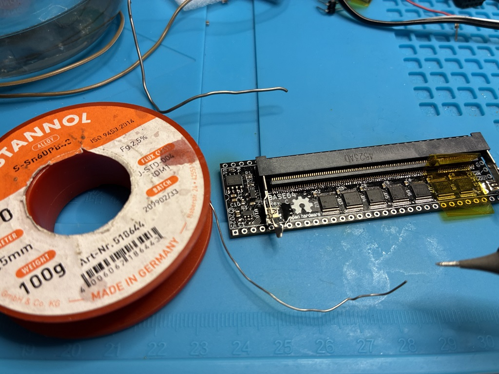
</a>

*Hand-soldering the 200 pins with 0.5 mm Sn60Pb40. Uneven at this point — that is expected.*

### 5. Retention arms to the large GND pads

The socket's two metal retention arms land on large ground pours, which sink far more heat
than a normal iron can deliver. I use the **ZD-915 desoldering station** for this because it
has the thermal capacity; a large chisel tip on a high-power iron will also work.

1. Cover **U8 and R5 with kapton tape** first — they sit close to the pad and you do not want to disturb them.
2. Flux both pads.
3. Feed roughly a centimetre of 1 mm Sn60Pb40 into the ZD-915 nozzle and set the station to **360 °C**.
4. Come in at an angle so the nozzle touches both the exposed part of the pad and the arm at the same time.
5. Hold with gentle pressure for **3–4 seconds** until the solder flows down and spreads across the pad, then lift off.

Be careful not to let the nozzle rest against the connector body — the plastic will melt.
As with the pins, the joint does not need to look pretty yet.

<a href="images/Base64_soldering_big_gnd_pads_with_zd-915.jpg">
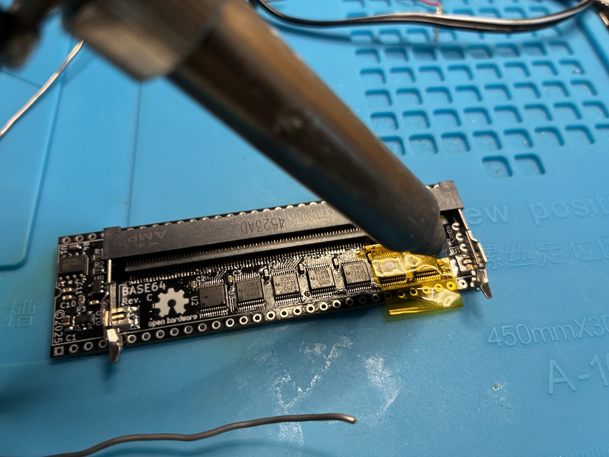
</a>

*ZD-915 at 360 °C on the ground pad, with U8 and R5 masked off under kapton tape.*

### 6. Reflow

At this point everything except the through-hole parts is soldered. Clean the spent flux off
the board, apply a fresh coat, and run it through the oven.

I use a **T-962 desktop IR oven** with the **Amtech SynTECH-LF** profile, which ramps to a
**240 °C peak** and then cools down.

<a href="images/Base64_boards_ready_for_reflow_oven.jpg">
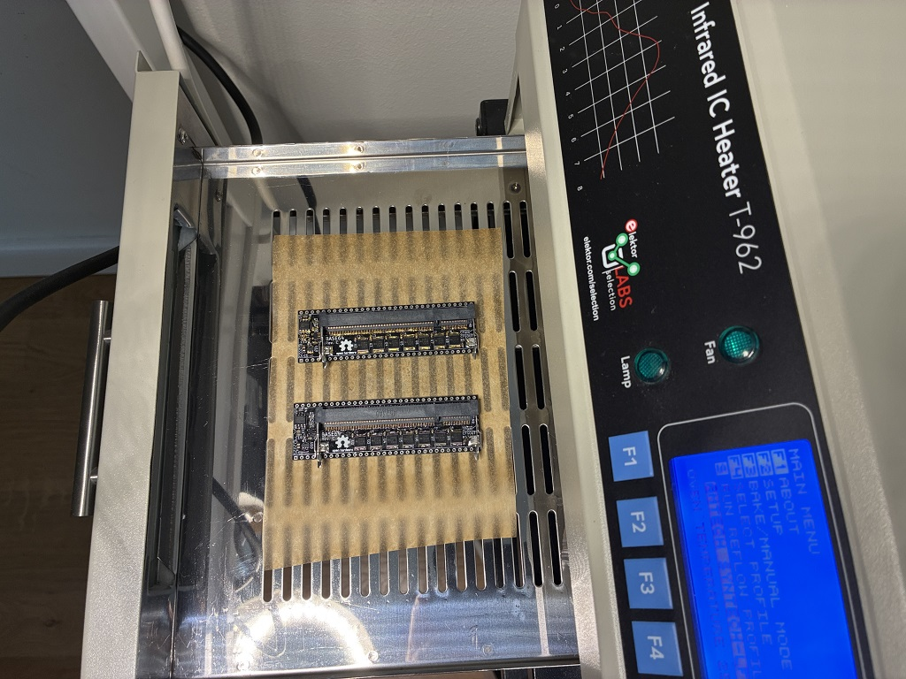
</a>

*Two boards loaded in the T-962.*

<a href="images/reflow_oven_profile_amtech_syntech_lf.jpg">
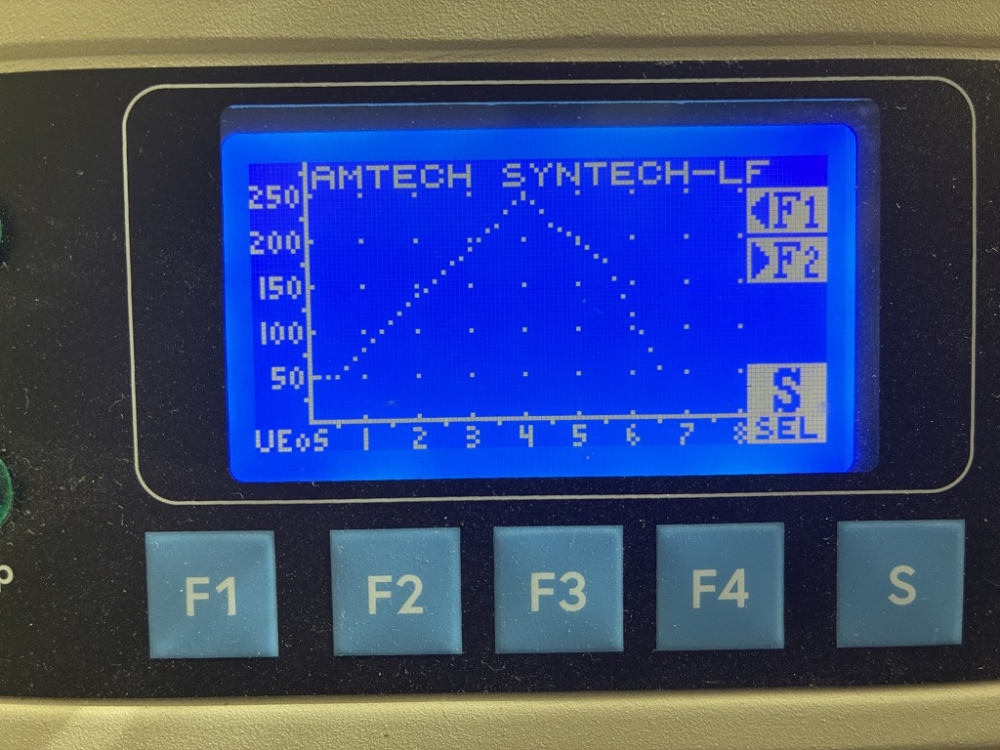
</a>

*The Amtech SynTECH-LF profile as shown on the T-962.*

Gravity and surface tension do the rest — joints that looked lumpy going in come out even.

### 7. Inspect and clean

Inspect every pin under magnification: each should have a clean fillet, and there should be
no bridges anywhere along the socket.

Then clean the board with cotton buds and IPA.

**For the ICs, don't use neat IPA** — it lifts the laser marking off the packages. I use a
general-purpose electronics cleaner instead, with the compound:

> Hydrocarbons, C6-C7, n-alkanes, isoalkanes, cyclics, <5 % n-hexane, 2-Propanol

Applied to a clean cotton bud and wiped gently over the package, this cleans the ICs without
erasing the text the way 100 % IPA does.

<a href="images/electronics_cleaner_for_ICs_preserve_text.jpg">
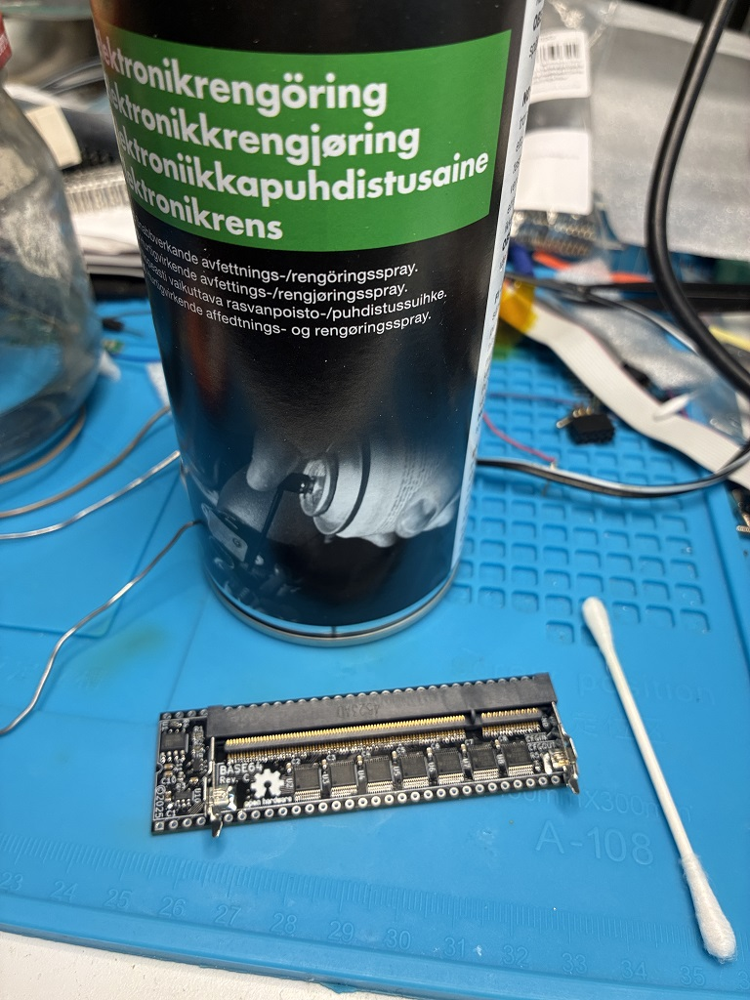
</a>

*Electronics cleaner used on the ICs — cleans without taking the markings with it.*

<a href="images/Base64_boards_after_reflow_and_cleanup.jpg">
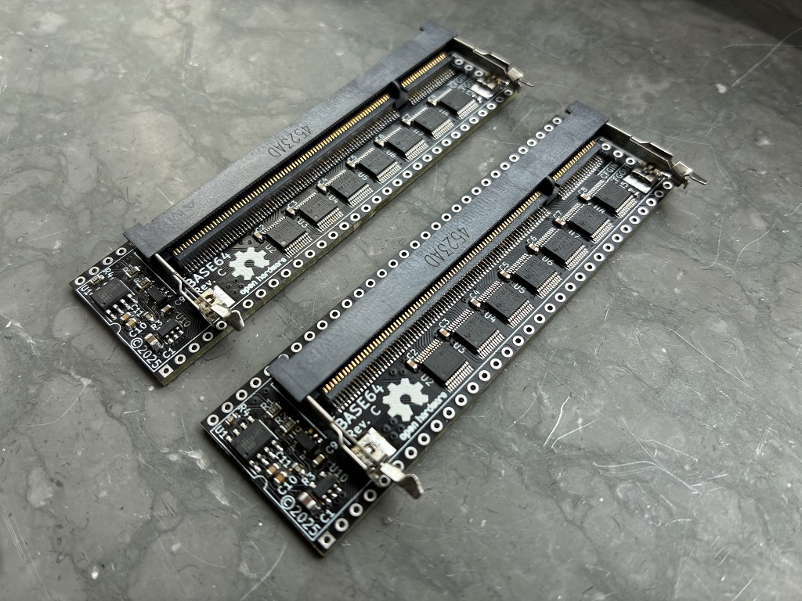
</a>

*Two boards after reflow and cleanup.*

### 8. Through-hole parts

Last come the two 32-pin strips (**U11**) and the 3-pin CFG header (**J2**).

Push each 32-pin section through the carrier board pads **from the top** and solder on the
top side. The protruding bottom side is what plugs into the host system's MC68000 socket.

The 32-pin sections are broken out of cheap 40-pin breakaway strips, and the break leaves a
rougher edge on that end. It makes no difference electrically, but it is a nice touch to
orient both strips so the **clean edges face the same way** — which of course puts both rough
edges on the other side.

<a href="images/pin_strips_nice_edges_oriented_to_same_side.jpg">
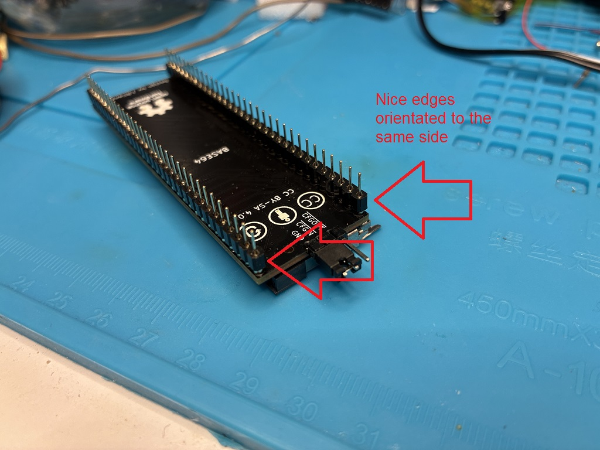
</a>

*Clean edges on the same side …*

<a href="images/pin_strips_rough_edges_oriented_to_same_side.jpg">
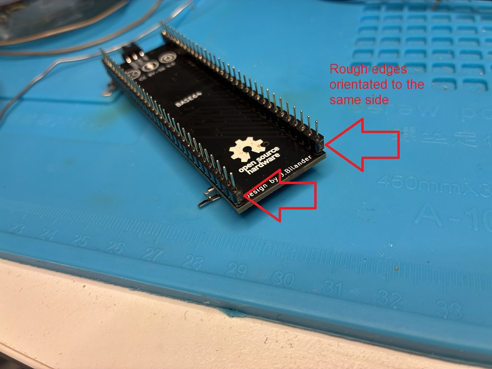
</a>

*… and the two broken edges together on the other.*

Finish with a final clean of the through-hole joints using cotton buds and IPA to remove the
excess flux.

### Alternative approaches

Hand-soldering the 200 pins is the slow way. Two alternatives worth considering:

- **Solder paste and hot air** on the SO-DIMM socket, with the connector's plastic body masked off with kapton tape so the hot air doesn't deform it.
- **Order a solder paste stencil** together with the PCBs. Then it becomes paste, place, reflow — and almost all of the hand work above disappears. Only worth it if you intend to build a batch.

### A note on the FPGA module

On my own iCESugar-Pro module I found a mark on the **25 MHz crystal oscillator** that looks
like it may have been made by a pin during installation of the module. I can't say for
certain where the dent came from, or whether it is a problem at all — it is worth a look
under a microscope if you have one. As a precaution I put a piece of kapton tape over the
oscillator.

<a href="images/kapton_tape_on_crystal_oscillator_on_fpga_board.jpg">
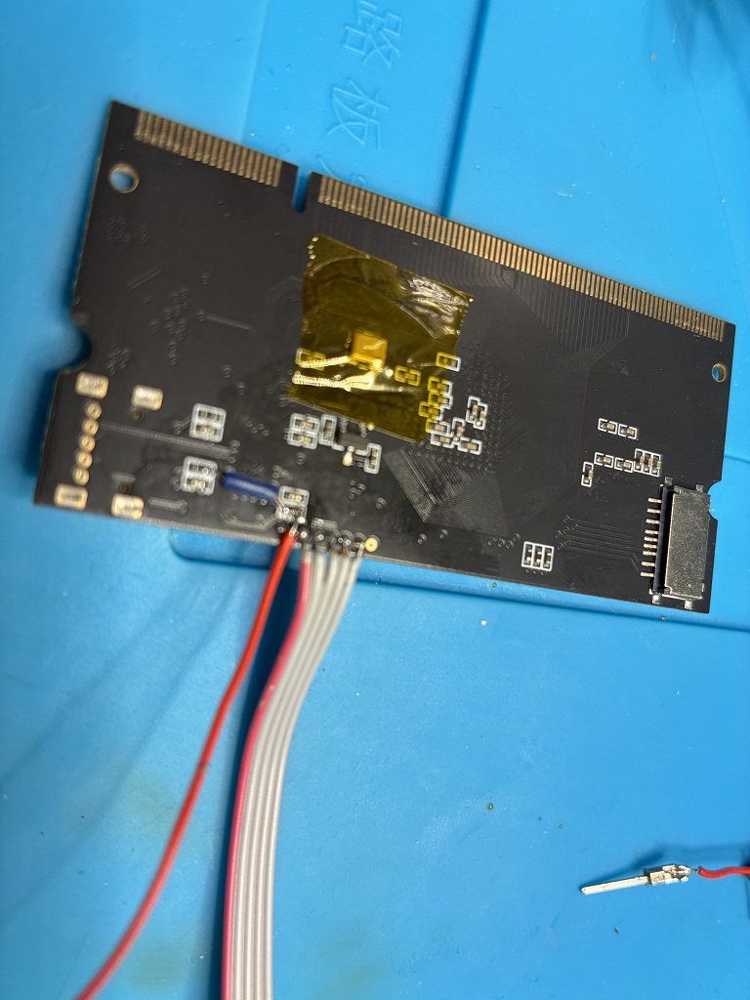
</a>

*Kapton tape over the 25 MHz oscillator on the iCESugar-Pro module.*

***

## Status

Rev C changes vs Rev B:
- ICS501MLFT clock multiplier replaced with ICS570BLFT (adds feedback pin for phase-aligned operation)
- 74AHCT1G17 (5 V) replaced with 74LVC1G17 (3.3 V, 5 V-tolerant inputs)
- Added TLV75533 LDO to generate local 3.3 V rail
- Clock subsystem reworked for cleaner signal integrity (source-side series termination on every branch)
- 84 MHz output routed to FPGA's PL26A (L1, PCLKT6_1/HS+) clock-capable input
