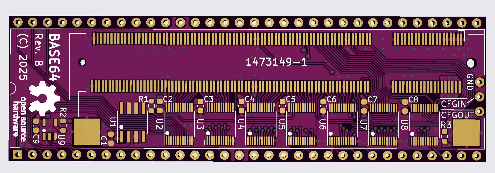
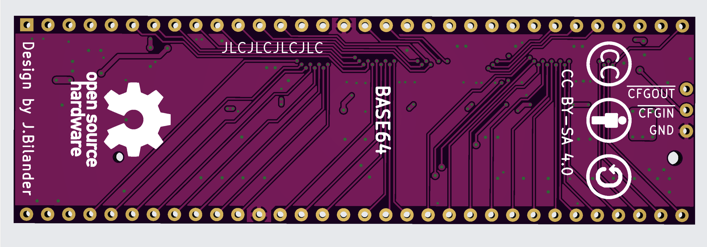

# Base64
A 68k carrier board in DIP-64 that takes the [iCESugar-Pro-v1.3](https://github.com/wuxx/icesugar-pro) FPGA module

Work in progress, hardware not yet verified!

***

 

 

 

***

## Hardware overview (Rev C)

- 4-layer PCB with continuous ground plane on layer 2 and +5V plane on layer 3
- iCESugar-Pro v1.3 FPGA module mounts via 200-pin SO-DIMM (DDR2) socket
- DIP-64 footprint, pin-compatible with the MC68000 socket in an Amiga 500 (or similar 68k host)
- 7× SN74CBTD3861 FET bus switches for bidirectional 5 V ↔ 3.3 V level translation on all bus signals
- Clock subsystem: 7 MHz host clock → 84 MHz phase-aligned output to the FPGA, locked to the host's 7 MHz with ~300 ps skew
- Autoconfig daisy-chain header (J2) for use alongside expansion-edge devices like the A590
- 3.3 V rail generated locally from the 5 V CPU socket supply via TLV75533 LDO

## Clock architecture

The host system provides a 7.09 MHz reference (E-clock derivative) on the CPU socket pin 15.
This is buffered by the 74LVC1G17 Schmitt-trigger gate (powered from the local 3.3 V rail,
with 5 V-tolerant inputs) and routed both to the FPGA at PT27A (C7, PCLKT0_1/+) and to the
ICS570B zero-delay clock multiplier (configured for 12× via floating S0/S1 with CLK/2
feedback).

The 570B produces a phase-aligned 84 MHz on CLK and 42 MHz on CLK/2. The 84 MHz output
feeds the FPGA at PL26A (L1, PCLKT6_1/HS+), which is well above the ECP5's 8 MHz PFD
minimum and locks reliably to the on-chip PLL. Inside the FPGA, the 84 MHz is divided
down to produce turbo CPU clocks (14 / 21 / 28 / 42 MHz) that remain phase-aligned to
the original 7 MHz reference.

## Required module

The Base64 carrier board requires an [iCESugar-Pro v1.3 FPGA module](https://github.com/wuxx/icesugar-pro) by Muse Lab, which mounts into the SO-DIMM socket (J1). The module carries the Lattice ECP5 LFE5U-25F-6BG256C FPGA along with onboard 32 MB SDRAM, 32 MB SPI flash, and an iCELink USB-C programmer.

Available from the official [Muse Lab AliExpress store](https://www.aliexpress.com/item/1005002270742248.html).

## Bill of materials

| Ref | Qty | Value / Part | Description | Package | Mouser P/N |
|-----|-----|--------------|-------------|---------|------------|
| U1 | 1 | ICS570BILF | Zero-delay clock multiplier with feedback (12× config) | SOIC-8 | [972-570BLFT](https://www.mouser.com/ProductDetail/972-570BLFT) |
| U2–U8 | 7 | SN74CBTD3861DGVR | 10-bit FET bus switch with 5 V→3.3 V diode level shift | TVSOP-24 | [595-SN74CBTD3861DGVR](https://www.mouser.com/ProductDetail/595-SN74CBTD3861DGVR) |
| U9 | 1 | SN74LVC1G17DBVR | Single Schmitt-trigger buffer, 5 V-tolerant inputs | SOT-23-5 | [595-SN74LVC1G17DBVR](https://www.mouser.com/ProductDetail/595-SN74LVC1G17DBVR) |
| U10 | 1 | TLV75533PDBVR | 3.3 V LDO regulator, 500 mA, fixed output | SOT-23-5 | [595-TLV75533PDBVR](https://www.mouser.com/ProductDetail/595-TLV75533PDBVR) |
| C1 | 1 | 1 µF | LDO input cap, X7R, 25 V | 0805 | [187-CL21B105KAFNNNE](https://www.mouser.com/ProductDetail/187-CL21B105KAFNNNE) |
| C2–C10 | 9 | 100 nF | CBTD / buffer / LDO output decoupling, X7R, 50 V | 0603 | [187-CL10B104KA8NNNC](https://www.mouser.com/ProductDetail/187-CL10B104KA8NNNC) |
| C11 | 1 | 10 nF | 570B VDD decoupling (per datasheet), X7R, 50 V | 0603 | [187-CL10B103KA8WPNC](https://www.mouser.com/ProductDetail/187-CL10B103KA8WPNC) |
| R1–R2 | 2 | 33 Ω | Series termination, 1% | 0805 | [652-CR0805FX-33R0ELF](https://www.mouser.com/ProductDetail/652-CR0805FX-33R0ELF) |
| R3–R4 | 2 | 33 Ω | Series termination, 1% | 0603 | [652-CR0603FX-33R0ELF](https://www.mouser.com/ProductDetail/652-CR0603FX-33R0ELF) |
| R5 | 1 | 10 kΩ | Autoconfig daisy-chain pull-up, 1% | 0603 | [652-CR0603FX-1002ELF](https://www.mouser.com/ProductDetail/652-CR0603FX-1002ELF) |
| J1 | 1 | TE 1473149-4 | 200-pin SO-DIMM (DDR2) socket for FPGA module | THT | [571-1473149-4](https://www.mouser.com/ProductDetail/571-1473149-4) |
| J2 | 1 | 3-pin right-angle header | Autoconfig daisy-chain (/CFGIN, /CFGOUT, GND), 0.64 mm square, 2.54 mm pitch | THT | [AliExpress](https://www.aliexpress.com/item/32963604292.html) |
| U11 | 64 | Single round male pin, 2.54 mm | DIP-64 CPU socket pins, ~11.96 mm overall length | THT | [AliExpress](https://www.aliexpress.com/item/32887861343.html) |

### Assembly notes

**U11 (CPU socket pins):** these are individual round male pins on 2.54 mm pitch, ~11.96 mm in overall height (top of pin to bottom of pin). Sourced as 32-pin sections from breakaway 40-pin strips. Push them through the carrier board pads from the top, solder on the top side, then plug the protruding bottom side into the host system's MC68000 socket.

**J2 (autoconfig daisy-chain):**
- Pin 1: /CFGIN
- Pin 2: /CFGOUT
- Pin 3: GND

If the host has no other autoconfig device on the side expansion (e.g. no A590), place a jumper shunt between pin 1 (/CFGIN) and pin 3 (GND) so the FPGA autoconfigs immediately. If there *is* a side expansion device, connect that device's /CFGOUT signal to J2 pin 1 (/CFGIN) so devices daisy-chain in the expected order (side expansion configures first, then Base64).

J2 uses a standard 0.64 mm square 2.54 mm pitch right-angle pin header. Available from AliExpress directly as a 3-pin part, or cut from a 40-pin breakaway strip.

## Status

Work in progress, hardware not yet verified.

Rev C changes vs Rev B:
- ICS501MLFT clock multiplier replaced with ICS570BLFT (adds feedback pin for phase-aligned operation)
- 74AHCT1G17 (5 V) replaced with 74LVC1G17 (3.3 V, 5 V-tolerant inputs)
- Added TLV75533 LDO to generate local 3.3 V rail
- Clock subsystem reworked for cleaner signal integrity (source-side series termination on every branch)
- 84 MHz output routed to FPGA's PL26A (L1, PCLKT6_1/HS+) clock-capable input
